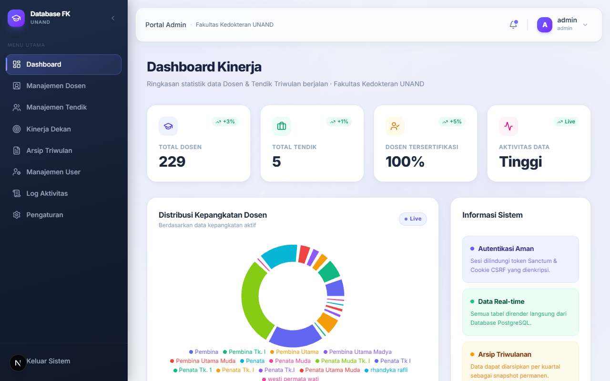
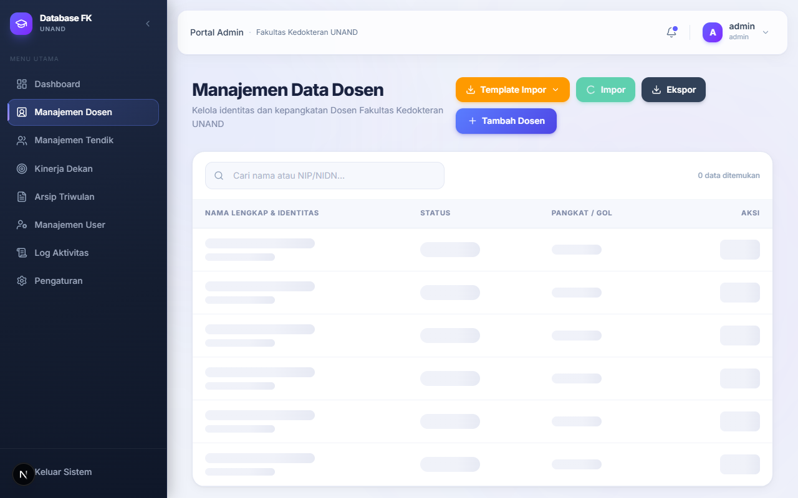
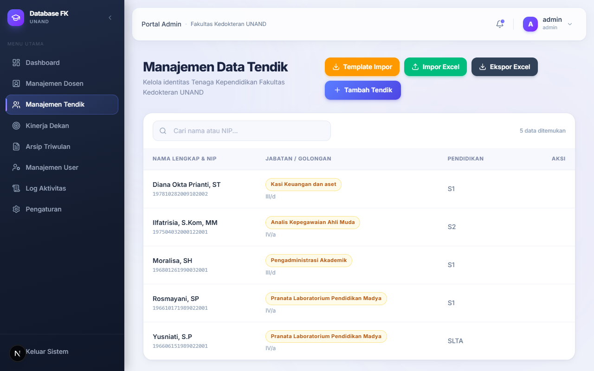

# 📚 Sistem Informasi Database Dosen & Tendik FK UNAND

<div align="center">


Sistem Informasi manajemen data **Dosen** dan **Tenaga Kependidikan (Tendik)** untuk **Fakultas Kedokteran Universitas Andalas (FK UNAND)**.

[Fitur Utama](#-fitur-utama) • [Tech Stack](#-tech-stack) • [Instalasi](#-instalasi) • [API Endpoint](#-api-endpoint) • [Struktur Proyek](#-struktur-proyek)

</div>

---

## 📋 Tentang Proyek

Aplikasi ini dibangun untuk mempermudah pengelolaan, pemantauan, dan pelaporan data Dosen dan Tenaga Kependidikan (Tendik) di lingkungan Fakultas Kedokteran Universitas Andalas. Sistem ini mendukung berbagai role pengguna dengan hak akses yang berbeda, dilengkapi dengan fitur audit trail, soft delete, export/import Excel, serta arsip data triwulanan.

---

## ✨ Fitur Utama

### 👩‍💼 Manajemen Data
- **CRUD Dosen & Tendik** — tambah, lihat, edit, dan hapus (soft delete) data pegawai
- **Import & Export Excel** — import data massal dari file `.xlsx` / `.csv`, export ke Excel
- **Perhitungan Otomatis** — usia dan masa kerja dihitung dinamis berdasarkan tanggal lahir/TMT
- **Soft Delete** — data tidak dihapus permanen, dapat dipulihkan kapan saja

### 📊 Dashboard & Analitik
- **Statistik Ringkas** — total Dosen, Tendik, distribusi status NIDN/NIDK/PPPK
- **KPI Capaian Kinerja Dekan** — target vs. realisasi, visualisasi grafis dengan Recharts
- **Grafik Distribusi** — distribusi gender, jabatan fungsional, dan rentang usia pegawai

### 🔐 Role-Based Access Control (RBAC)
| Role | Akses |
|---|---|
| **Super Admin** | CRUD penuh semua data, manajemen user, activity log |
| **Dekan** | Read-only seluruh data, akses eksklusif dashboard KPI |
| **PJ Departemen / Bagian** | CRUD terbatas pada Dosen/Tendik di departemennya |
| **Dosen / Tendik** | Pengajuan pembaruan data mandiri |

### 🗂️ Fitur Lanjutan
- **Audit Trail** — setiap perubahan data dicatat siapa yang mengubahnya (`updated_by`)
- **Arsip Triwulanan (Quarterly Snapshots)** — snapshot data per kuartal dalam format JSONB
- **Activity Log** — rekam jejak seluruh aktivitas pengguna di sistem
- **Manajemen User** — admin dapat menambah, mengubah role, dan menonaktifkan akun

---

## 🛠️ Tech Stack

### Backend
| Teknologi | Versi | Keterangan |
|---|---|---|
| PHP | ^8.3 | Runtime |
| Laravel | ^13.0 | Framework utama |
| Laravel Sanctum | ^4.0 | Autentikasi API (token-based) |
| Maatwebsite/Excel | ^3.1 | Export & Import Excel |
| SQLite / PostgreSQL | - | Database |

### Frontend
| Teknologi | Versi | Keterangan |
|---|---|---|
| Next.js | 16.2.1 | React Framework (App Router) |
| React | 19.2.4 | UI Library |
| TypeScript | ^5 | Type-safe development |
| Tailwind CSS | ^4 | Utility-first styling |
| Framer Motion | ^12 | Animasi UI |
| Recharts | ^3 | Visualisasi data/grafik |
| Zustand | ^5 | State management |
| Axios | ^1.13 | HTTP client |
| Lucide React | ^1.6 | Icon library |
| Sonner | ^2 | Toast notifications |

---

## 📁 Struktur Proyek

```
Database Dosen dan Tendik/
├── backend/                    # Laravel API
│   ├── app/
│   │   ├── Http/
│   │   │   └── Controllers/
│   │   │       └── Api/        # AuthController, DosenController, TendikController, dll.
│   │   ├── Models/             # Dosen, Tendik, User, Snapshot, dll.
│   │   ├── Exports/            # DosenExport, TendikExport (Maatwebsite)
│   │   ├── Imports/            # DosenImport, TendikImport
│   │   └── Services/           # Logika bisnis (perhitungan masa kerja, dll.)
│   ├── database/
│   │   ├── migrations/         # Skema tabel database
│   │   └── seeders/            # Data awal (roles, admin default)
│   ├── routes/
│   │   └── api.php             # Semua endpoint API
│   └── .env.example            # Template konfigurasi environment
│
└── frontend/                   # Next.js App
    └── src/
        ├── app/
        │   ├── (auth)/         # Halaman login
        │   └── (dashboard)/    # Halaman utama (protected)
        │       ├── page.tsx    # Dashboard utama
        │       ├── dosen/      # Manajemen data Dosen
        │       ├── tendik/     # Manajemen data Tendik
        │       ├── kpi/        # Dashboard KPI Dekan
        │       ├── snapshots/  # Arsip triwulanan
        │       ├── users/      # Manajemen pengguna
        │       ├── logs/       # Activity log
        │       └── settings/   # Pengaturan akun
        ├── components/         # Komponen UI reusable
        ├── lib/                # Utilities & API client
        └── store/              # Zustand global state
```

---

## 🚀 Instalasi

### Prasyarat
- **PHP** >= 8.3
- **Composer** >= 2.x
- **Node.js** >= 20.x & **npm**
- **Laragon / XAMPP / Laravel Herd** (atau web server lokal lainnya)
- **Database**: SQLite (default, tanpa konfigurasi tambahan) atau PostgreSQL

---

### 1. Clone Repository

```bash
git clone https://github.com/Aqfa07/faculty-database-system.git
cd "faculty-database-system"
```

---

### 2. Setup Backend (Laravel)

```bash
cd backend

# Install dependensi PHP
composer install

# Salin file environment
cp .env.example .env

# Generate application key
php artisan key:generate
```

**Konfigurasi `.env`** — sesuaikan pengaturan database:

```env
APP_NAME="Database Dosen Tendik FK UNAND"
APP_URL=http://localhost:8000

# Untuk SQLite (default, tidak perlu setting tambahan):
DB_CONNECTION=sqlite

# Untuk PostgreSQL (opsional):
# DB_CONNECTION=pgsql
# DB_HOST=127.0.0.1
# DB_PORT=5432
# DB_DATABASE=db_dosen_tendik
# DB_USERNAME=postgres
# DB_PASSWORD=secret

FRONTEND_URL=http://localhost:3000
```

```bash
# Jalankan migrasi database
php artisan migrate

# (Opsional) Jalankan seeder untuk data awal
php artisan db:seed

# Jalankan server backend
php artisan serve
```

> Backend akan berjalan di: **http://localhost:8000**

---

### 3. Setup Frontend (Next.js)

```bash
cd ../frontend

# Install dependensi Node.js
npm install
```

Buat file `.env.local` di folder `frontend/`:

```env
NEXT_PUBLIC_API_URL=http://localhost:8000/api
```

```bash
# Jalankan development server
npm run dev
```

> Frontend akan berjalan di: **http://localhost:3000**

---

### 4. Login Default

Setelah seeder dijalankan, gunakan kredensial berikut untuk login pertama:

| Email | Password | Role |
|---|---|---|
| `admin@fk.unand.ac.id` | `password` | Super Admin |

> ⚠️ **Segera ganti password** setelah login pertama kali!

---

## 🔌 API Endpoint

Semua endpoint (kecuali login) memerlukan header:
```
Authorization: Bearer <token>
```

### Autentikasi
| Method | Endpoint | Keterangan |
|---|---|---|
| `POST` | `/api/auth/login` | Login & dapatkan token |
| `GET` | `/api/auth/me` | Info user yang sedang login |
| `POST` | `/api/auth/logout` | Logout & revoke token |
| `POST` | `/api/auth/password` | Ubah password |

### Dosen
| Method | Endpoint | Keterangan |
|---|---|---|
| `GET` | `/api/dosens` | Daftar semua dosen |
| `POST` | `/api/dosens` | Tambah dosen baru |
| `GET` | `/api/dosens/{id}` | Detail dosen |
| `PUT` | `/api/dosens/{id}` | Update data dosen |
| `DELETE` | `/api/dosens/{id}` | Soft delete dosen |
| `GET` | `/api/dosens/export` | Export data dosen ke Excel |
| `POST` | `/api/dosens/import` | Import data dosen dari Excel |

### Tendik
| Method | Endpoint | Keterangan |
|---|---|---|
| `GET` | `/api/tendiks` | Daftar semua tendik |
| `POST` | `/api/tendiks` | Tambah tendik baru |
| `GET` | `/api/tendiks/{id}` | Detail tendik |
| `PUT` | `/api/tendiks/{id}` | Update data tendik |
| `DELETE` | `/api/tendiks/{id}` | Soft delete tendik |
| `GET` | `/api/tendiks/export` | Export data tendik ke Excel |
| `POST` | `/api/tendiks/import` | Import data tendik dari Excel |

### Lainnya
| Method | Endpoint | Keterangan |
|---|---|---|
| `GET` | `/api/dashboard/metrics` | Statistik dashboard |
| `GET` | `/api/kpi` | Data KPI Dekan |
| `POST` | `/api/snapshots/finalize` | Finalisasi arsip kuartal |
| `GET` | `/api/snapshots` | Daftar arsip kuartal |
| `GET` | `/api/users` | Daftar pengguna |
| `GET` | `/api/activity-logs` | Log aktivitas sistem |

---

## 📸 Screenshot

> *Screenshot dashboard dan tampilan antarmuka aplikasi.*

| Dashboard Utama | Data Dosen | Data Tendik |
|---|---|---|
|  |  |  |

---

## 🗄️ Skema Database

Diagram relasi entitas utama:

```
users ──────────────────────────────────────┐
  │                                         │
  ├── dosen (created_by, updated_by)         │
  │     └── [soft delete: deleted_at]        │
  │                                         │
  ├── tendik (created_by, updated_by)        │
  │     └── tendik_diklat (one-to-many)      │
  │                                         │
  └── quarterly_snapshots ──────────────────┘
        ├── snapshot_dosen (JSONB)
        └── snapshot_tendik (JSONB)
```

---

## 🔒 Keamanan

- Autentikasi menggunakan **Laravel Sanctum** (token-based, stateless)
- Password di-hash menggunakan **bcrypt** (rounds: 12)
- **Soft Delete** mencegah penghapusan data permanen
- **Audit Trail** mencatat setiap perubahan data (`created_by`, `updated_by`)
- **CORS** dikonfigurasi untuk hanya mengizinkan origin frontend

---

## 📄 Lisensi

Proyek ini dikembangkan untuk keperluan internal **Fakultas Kedokteran Universitas Andalas**.

---

<div align="center">
  Dikembangkan dengan ❤️ untuk FK UNAND
</div>
